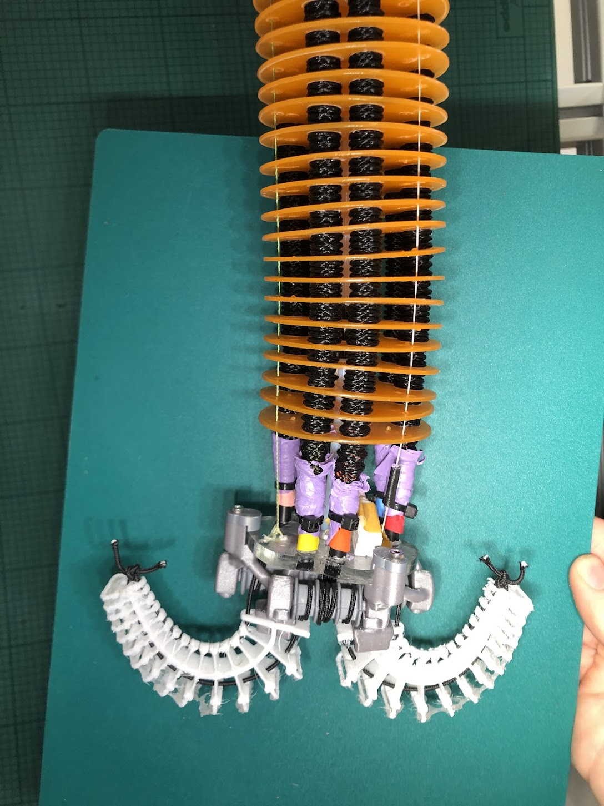

# Design and Development of a Bio-Inspired, Lightweight Soft Robotic Gripper

Bachelor thesis project by Mads and Emil, DTU 2026.

This repository contains the 3D printing/casting files, the Arduino firmware, and the raw
experimental data collected for the gripper. It is written so that a future student can pick
the project back up: print/cast the parts, wire up the electronics, flash the firmware, and
reproduce (or extend) the tests.



## Repository layout

```
.
├── 3d_files/            STEP + STL files for all printed/cast parts
├── code/
│   └── bsc-gripper/     PlatformIO firmware project (Arduino Uno)
├── raw_data/            CSV logs + a couple of analysis scripts from testing
└── gripper.jpg          Photo of the assembled gripper
```

## 1. Hardware overview

The gripper is a single tendon-driven finger, actuated by two DYNAMIXEL smart servos (one
"flexor" and one "extensor" tendon) pulling on a soft finger through a cable-drum mechanism.

Bill of materials, as far as it can be reconstructed from the code and test data — **please
correct/extend this list once you've rebuilt the setup**, since the full BOM lives in the
thesis report, not in this repo:

| Part | Notes |
|---|---|
| Arduino Uno | Runs the firmware in `code/bsc-gripper` |
| DYNAMIXEL Shield for Arduino Uno | Stacks on top of the Uno, handles the DYNAMIXEL bus + external power |
| 2x DYNAMIXEL X-series servo (e.g. XL330-M288 / XL430-W250) | One flexor, one extensor tendon. IDs must be set to **8 (extensor)** and **9 (flexor)** beforehand (see below) |
| External power supply | For the DYNAMIXEL Shield's motor power input — voltage must match the servos you use (see §3) |
| HX711 load-cell amplifier + load cell | Optional, used for grip-force logging (disabled by default, see `debugLoadCells` in `config.h`) |
| Momentary push button | Manually toggles grip/release |
| 3D printed/cast finger + mounting hardware | See `3d_files/` below |

### 3D printed / cast parts (`3d_files/`)

Both `.step` (editable CAD) and `.stl` (ready-to-slice) versions of every part are included.

| File | Purpose (inferred from naming — verify against the thesis) |
|---|---|
| `Finger mold.stl/.step` | Mold used to cast the soft silicone finger |
| `Finger - with supports.stl/.step` | The soft finger part, with support structures already modeled in for casting/printing |
| `Finger - without supports.stl/.step` | Same finger part without supports (use if your slicer/printer generates its own supports) |
| `Finger mount.step` | Full assembly reference for the rigid finger mount |
| `Finger mount - Small drum half.stl/.step` | One half of the tendon-winding drum, mounted on the smaller (extensor) servo horn |
| `Finger mount - Large drum half.stl/.step` | One half of the tendon-winding drum, mounted on the larger (flexor) servo horn |
| `Finger mount - Arm Interface Cap.stl/.step` | Cap that interfaces the mount to the robot arm / test rig |

**Before you print:** open the `.step` files in your CAD tool of choice to confirm dimensions
and tolerances still make sense for your printer/material, and note down (in this README) what
material/printer settings actually worked — that information is not currently captured
anywhere in the repo.

## 2. Firmware (`code/bsc-gripper`)

This is a [PlatformIO](https://platformio.org/) project targeting the Arduino Uno
(`env:uno` in `platformio.ini`). It uses two libraries, pulled automatically by PlatformIO:

- [`robotis-git/Dynamixel2Arduino`](https://github.com/ROBOTIS-GIT/Dynamixel2Arduino) — communication with the DYNAMIXEL servos
- [`RobTillaart/HX711`](https://github.com/RobTillaart/HX711) — load cell amplifier

### Source files

| File | Responsibility |
|---|---|
| `src/main.cpp` | Setup/loop, grip-button handling, periodic sampling & debug printing |
| `src/config.h` | All tunable constants: pin numbers, motor IDs, current/PWM limits, grip-state timing & control gains |
| `src/dynamixel_control.{h,cpp}` | DYNAMIXEL init, sync-write of goal PWM, feedback reading, and the grip state machine (`GRIP_OPEN → GRIP_CLOSING → GRIP_TIGHTEN → GRIP_HOLDING → GRIP_RELEASING`) |
| `src/load_cell.{h,cpp}` | HX711 init & reading (only active if `debugLoadCells = true` in `config.h`) |
| `src/serial_config.{h,cpp}` | Defines which UART is used for DYNAMIXEL vs. debug printing |

### Setting up PlatformIO

1. Install [VS Code](https://code.visualstudio.com/) and the **PlatformIO IDE** extension
   (already recommended in `.vscode/extensions.json` — VS Code should prompt you to install it
   when you open `code/bsc-gripper`).
   - Alternatively, install the [PlatformIO Core CLI](https://docs.platformio.org/en/latest/core/installation/index.html).
2. Open the folder `code/bsc-gripper` in VS Code (not the repo root — PlatformIO looks for
   `platformio.ini` in the opened folder).
3. Let PlatformIO install the `atmelavr` platform and the two libraries from `platformio.ini`
   on first build (it does this automatically).

### Building & uploading

Using the PlatformIO toolbar in VS Code (checkmark = build, arrow = upload), or from the CLI
inside `code/bsc-gripper`:

```bash
pio run            # build
pio run -t upload   # build + flash the Arduino Uno
pio device monitor  # open a serial monitor
```

**Before flashing:** connect the Arduino Uno via USB, with the DYNAMIXEL Shield stacked on top
and the servo power supply connected (the servos don't need to be powered to upload code, but
they must be powered for the firmware to get past `dxl_init()`, which blocks in a `while` loop
pinging the motors until they respond).

### DYNAMIXEL servo setup (one-time, per servo)

The firmware expects the extensor servo at **ID 8** and the flexor servo at **ID 9**, both at
protocol 2.0 and a bus baud rate of **1,000,000 bps** (`dxl.begin(1000000)` in
`dynamixel_control.cpp`). Before first use, set each servo's ID with
[DYNAMIXEL Wizard 2.0](https://emanual.robotis.com/docs/en/software/dynamixel/dynamixel_wizard2/)
(connect each servo individually via a U2D2 or the shield) — the default factory ID is usually
`1`, so both servos need to be re-IDed before being wired into the same bus.

### Debug/monitor output

Because the Arduino Uno only has one hardware UART, and that UART is used for the DYNAMIXEL
bus, debug printing goes over a `SoftwareSerial` port instead (see `serial_config.h`/`.cpp`,
pins defined by `DXL_SHIELD_UART_RX`/`DXL_SHIELD_UART_TX` in `config.h`). Open the serial
monitor at **115200 baud** to see the tab-separated debug stream: per-servo current, position,
PWM and velocity, load cell reading(s), current grip state, and grip round counter — printed
every `SAMPLING_PERIOD_MS` (100 ms by default).

### Key tunables in `config.h`

- `MAX_CURRENT` / `MAX_PWM` — hard current/PWM limits written to the servos on init
- `debugLoadCells` — set to `true` to enable HX711 reading/logging
- `*_FLEX_*` / `*_EXTE_*` groups (`OPEN_`, `CLOSING_`, `TIGHTEN_`, `HOLDING_`, `RELEASING_`) —
  per grip-state PWM slopes and limits driving the state machine in `dxl_update_state()`
- `C_LOAD_CELL_SCALE` — HX711 calibration factor (will need re-calibrating for a new load cell)

## 3. Electronics wiring

| Signal | Arduino/Shield pin | Defined as |
|---|---|---|
| DYNAMIXEL bus (via shield, hardware Serial) | — | handled by the shield |
| Debug UART RX/TX (SoftwareSerial) | 7 / 8 | `DXL_SHIELD_UART_RX` / `DXL_SHIELD_UART_TX` |
| DYNAMIXEL direction pin | 2 | `DXL_DIR_PIN` |
| Grip toggle button (to GND, `INPUT_PULLUP`) | 4 | `BTN_PIN` |
| HX711 clock | 5 | `ABC_LOAD_CELL_CLK` |
| HX711 data | 6 | `C_LOAD_CELL_DT` |
| Oscilloscope/debug timing pins | 9 / 10 | `SCOPE_PIN_A` / `SCOPE_PIN_B` |

**Power:** the DYNAMIXEL Shield needs its own external power input (separate from the Arduino's
USB power) for the servos — connect a supply matching your servos' rated voltage to the
shield's power jack/terminal (check the servo datasheet; different DYNAMIXEL X-series models
have different voltage ranges, so don't assume 12V is safe for every servo without checking
first). USB alone will not power the motors and `dxl_init()` will hang forever waiting for a
ping response.

## 4. Test data (`raw_data/`)

| Folder | Contents |
|---|---|
| `motor_performance_test/` | Logged current/PWM/load traces for the XL330 and XL430 servos under different PWM/duration settings |
| `finger_mount_test/` | Finger mount test data |
| `transmission_test/` | Tendon transmission efficiency data, plus `transmission_test.py` — computes the static friction coefficient (`mu_static`) from input/output force ratios and plots it |
| `payload_test/` | Grip trials against a set of test objects (`test_objects.csv` describes shape/dimensions/mass/surface of each object); filenames encode object id, sensor (`P`/`W`), fixture (`F`) and object (`X`/`L`/`S`) |
| `success_rate/` | Grasp success-rate trials (`data_succes.csv`) across different test objects/orientations |

## Notes for the next student

- The old, pre-PlatformIO firmware (`code/main_firmware_version/`) has been superseded by the
  PlatformIO project in `code/bsc-gripper/` — use the latter.
- Consider committing your DYNAMIXEL Wizard configuration/settings or a short calibration
  procedure once you've re-derived it, so servo setup doesn't have to be reverse-engineered
  from the firmware again.
- `main.cpp` has commented-out calls to a `dxl_auto_calibration()` step that is not defined
  anywhere in this repo (in current code or history) — it looks like a planned-but-never-added
  feature rather than something that was removed. Motors are currently expected to already be
  at a known/repeatable start position when `GRIP_OPEN` is reached.
