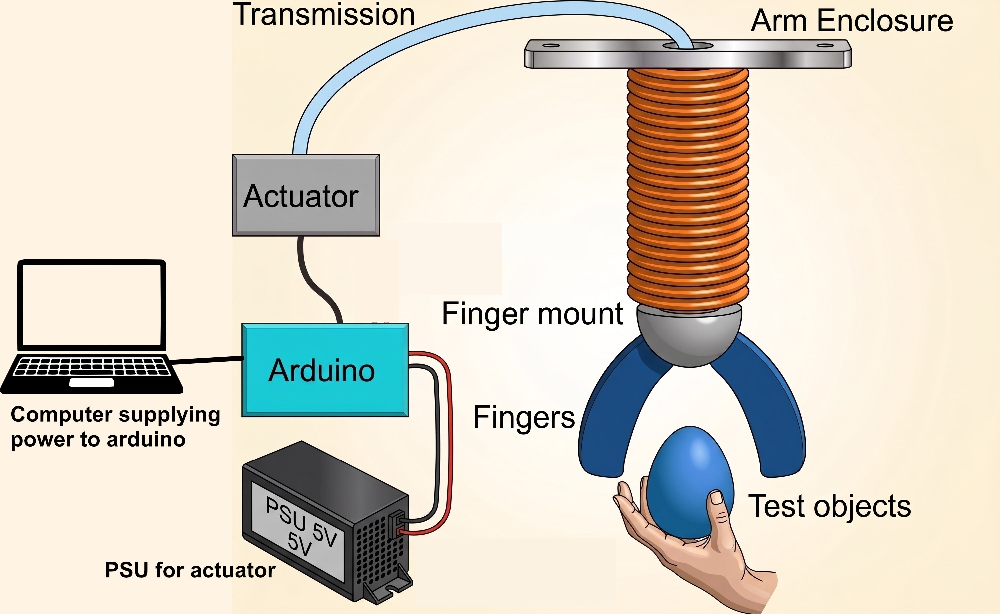

# Bio-Inspired, Lightweight Soft Robotic Gripper

A lightweight, tendon-driven soft robotic gripper developed as a Bachelor’s thesis at DTU (Neuro Robotics Technology Lab) by Mads August Claussen and Emil Broge Johansen.

The goal of this project was to design a compliant gripper that weighs almost nothing (only 37 g at the wrist!) so it can be mounted onto soft, low-payload continuum robotic arms without weighing them down. Instead of rigid fingers with lots of gears, it uses flexible 3D-printed fingers shaped like an octopus tentacle that wrap gently around objects of different shapes and sizes.

This repository contains the 3D printing/casting files, the Arduino firmware, and the raw experimental data collected for the gripper. It is written so that a future student can pick the project back up: print/cast the parts, wire up the electronics, flash the firmware, and reproduce (or extend) the tests.

<video src="documentation/gripper-showcase-vid.mp4" controls="controls" muted="muted" style="max-width: 100%;">
  Your browser does not support the video tag.
</video>

*(If you are viewing this locally, check out `documentation/gripper-showcase-vid.mp4` and `documentation/gripper_being_operated_and_powered_off.mp4` to see it in action!)*

---

## 1. System Architecture & Mechanism

To keep the hand as light as possible, we separated the "muscles" from the "fingers":

- **External Actuator Box:** Two smart servo motors sit away from the moving arm. One pulls the "flexor" tendon to close the grip, and the other pulls an "extensor" tendon to open it and add stiffness.
- **Bowden Cable Transmission:** The pulling force travels through slick PTFE tubes via strong polyethylene cords (Dyneema).
- **Cable Drum Wrist:** Inside the mount, small spools turn linear cable pulling into rotation without needing a bulky mechanism.
- **Octopus-Inspired Fingers:** The fingers are printed out of flexible TPU with built-in bending joints. They follow a logarithmic spiral shape so they naturally wrap around objects instead of pinching at a stiff angle.
- **Silicone Skin:** A soft silicone layer gives the fingers the grip they need so objects don't slip out.

**Below the gripper can be seen being operated.**
<video src="documentation/gripper-showcase-vid.mp4" controls="controls" muted="muted" style="max-width: 100%;">
  Your browser does not support the video tag.
</video>
---

## 2. Hardware Build Guide

The entire physical build uses affordable 3D-printed parts, standard hobbyist bearings, and two smart servos. The brain of the setup is an Arduino Uno fitted with a motor shield.

All step-by-step guides and CAD drawings are organized in the `documentation/` folder:
- **Parts List & Costs:** See the [Bill of Materials (PDF)](documentation/bill_of_materials_compressed.pdf)
- **Step-by-Step Mechanical Assembly:** See the [Assembly Guide (PDF)](documentation/assembly_instructions_compressed.pdf)
- **Fabrication & Print Specs:** See the [Hardware & Fabrication Guide](documentation/README.md#1-3d-printing--fabrication)
- **Full Thesis Report:** Read [Full BSc Report (PDF)](documentation/Full_BSc_Report_compressed_prepress.pdf) for the academic background, math, and design decisions.

---

## 3. Code & Electronics Build Guide

The microcontroller firmware is set up in `code/bsc-gripper/`. It handles motor communication, runs an automatic grip sequence, and streams diagnostic data.

- We use **PlatformIO** (via the VS Code extension) to compile and upload code automatically. [Setting up PlatformIO](code/bsc-gripper/PlatformIO.md)
- **Wiring & Pinout:** See the [Wiring Setup in documentation](documentation/README.md#2-electronics--wiring-setup).
- **Firmware Architecture & Motor Tuning:** See the [Firmware Deep-Dive](code/bsc-gripper/README.md) for pinouts, state machine explanations, and tuning constants in `config.h`.

---

## 4. Experimental Data (`raw_data/`)

All raw test data from our validation trials are available in `raw_data/`:
- `transmission_test/`: Tendon transmission efficiency measurements and `transmission_test.py` to calculate friction coefficients ($\mu$).
- `motor_performance_test/`: Current and force measurements for XL330 and XL430 servos.
- `payload_test/`: Pull-force test data across 11 test shapes (`test_objects.csv` describes dimensions and weights).
- `success_rate/`: Grasp trials (`data_succes.csv`) on real everyday objects.

---

## 5. Potential Improvements

If you're picking up this project for a semester project or thesis, here are several clear areas where you can take it further:

### Hardware Improvements
- **Miniaturization & Cleaner Enclosure:** Redesign the motor box to be smaller and more self-contained. Adding buttons directly to the enclosure would make manual testing much smoother (for example, triggering test routines or toggling live serial output).
- **Easier Finger Assembly:** Threading the tendons and securing the fingers to the mount currently requires a very specific touch and patience. A more modular, snap-in joint design would save a lot of headaches.
- **Self-Contained Power:** The prototype currently relies on a 5V benchtop power supply and a tethered laptop. Integrating a small internal regulator or battery pack would make the setup truly portable.
- **Tendon Terminations:** Finding a cleaner mechanical method to clamp the tendon ends (rather than manual knots) would make string tensioning and length adjustment much more repeatable.
- **User interface:** A simple GUI on a laptop or tablet could allow users to control the gripper, run test routines, and visualize live data without needing to dig into the Arduino code.

### Control Improvements
- **Scientifically Grounded Control:** The current firmware uses a tuned open-loop control. A great next step would be modeling the gripper movements analytically—for instance, using the approach from:
  > Z. Wang and N. M. Freris, *"Exploiting Frictional Effects to Reproduce Octopus-Like Reaching Movements with a Cable-Driven Spiral Robot,"* 2024 IEEE 7th International Conference on Soft Robotics (RoboSoft), San Diego, CA, USA, 2024, pp. 537-542.
- **Grasp Detection:** Use live motor current readings to detect when the fingers touch an object and stop pulling automatically.

---

## Notes for the Next Student

Don't hesitate to reach out, if you have any questions about the project. We are happy to help you get started and point you in the right direction.

- **Mads August Claussen**
- **Emil Broge Johansen**
